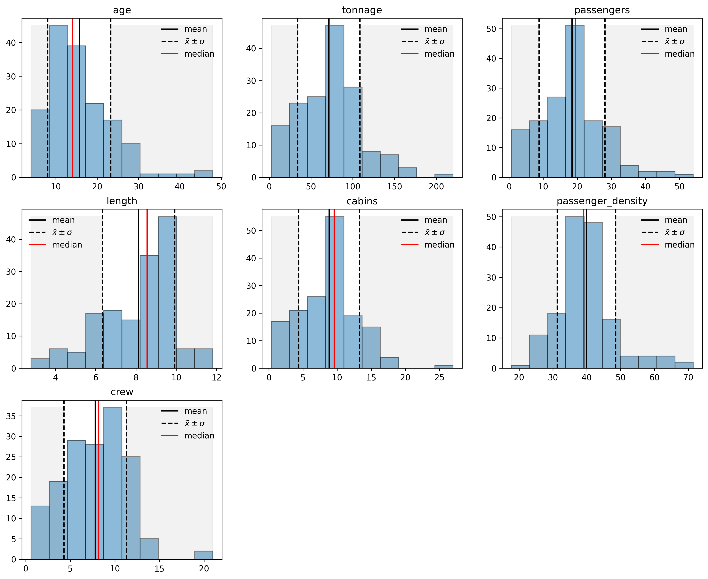
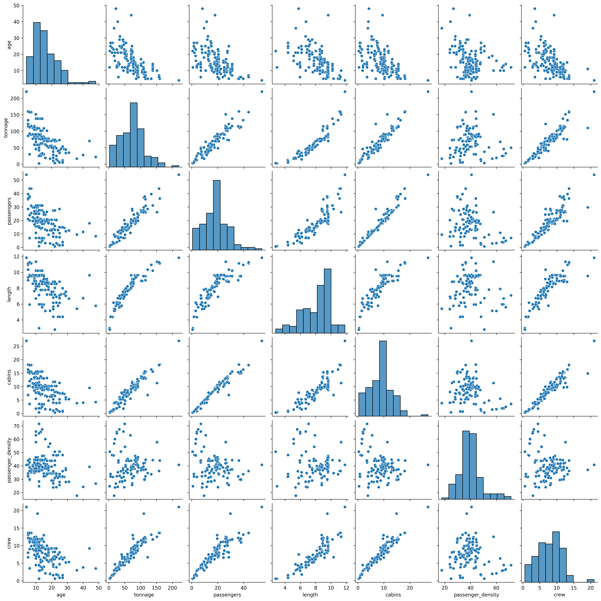

# Prueba de Aplicación a [Tusdatos.co](https://www.tusdatos.co/)

## Objetivo

Crear un regresor que recomiende el tamaño de la **tripulación** para los posibles compradores de barcos.

## Instrucciones

Esta prueba debe ser desarrolada con el lenguaje de programacion *Python*. El resultado debe ser cargado en un `Jupyter notebook` y debe ser cargado finalmente en un repositorio de `github` para su entrega.

## Datos

Los datos de la prueba pueden ser descargados del siguiente [enlace](https://drive.google.com/file/d/1sLcgR5yMTSWuy7D82x_oG7nmaz6KE3jR/view).

## Pasos a Seguir para el Desarollo de la Prueba

1. Leer el archivo
2. Mostrar las columnas
3. Calcular estadísticas básicas de los datos, interpretarlos y enunciar sus observaciones.
4. Seleccionar las columnas que se consideran importantes para predecir el tamaño de la tripulación (*crew*).
5. Si eliminas columnas explica la razón de la decisión tomada.
6. Utiliza *one-hot encoding* para las características categóricas.
7. Cree un conjunto de entrenamiento y prueba (utilice el 60% de los datos para el entrenamiento y el restante para prueba).
8. Cree un modelo de aprendizaje automático para predecir el tamaño de la tripulación.
9. Calcula el coeficiente de correlación de Pearson para el conjunto de entrenamiento y los conjuntos de datos de prueba. (**FALTA**)
10. Describa los hiperparámetros en su modelo y cómo los cambiaría para mejorar los rendimientos del modelo.
11. ¿Qué es la regularización?¿Cuál es el parámetro de regularización en su modelo?
12. Trazar el valor del parámetro de regularización frente a la correlación de Pearson para los conjuntos de prueba y entrenamiento, y ver si su modelo tiene un problema de sesgo o de varianza. (**FALTA**)

## Resultados Importantes

Imagen ilustrativa de un crucero y sus características

Histrogramas de cada unos de los parámetros numéricos, donde se aprecia la media (línea negra), la mediana (línea roja) y los valores de la media más 1 sigma (líneas negras punteadas).

Un gráfico de dispersión de los parámetros a través de la librería de Seaborn.

Cómo concusión final se tiene que a partir de una regresión Lasso para el modelo que recomienda a un comprodor un crusero basado en la cantidad que debe tener de tripulación (*crew*), los paramétros más importantes con sus respectivos coeficientes son

$$\text{crew} \sim (0.781)\text{passanger} + (6.675)\text{age} + (3.195)\text{length} - (0.652)\text{cabins}$$

donde la edad es uno de los factores más importantes.

